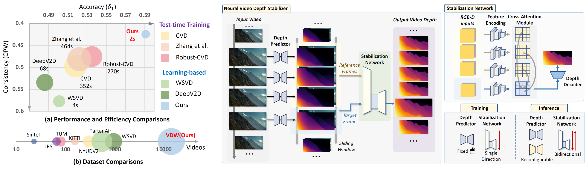

# Neural Video Depth Stabilizer (ICCV2023) 🚀🚀🚀

🎉🎉🎉 **Welcome to the NVDS GitHub repository!** 🎉🎉🎉  

**The repository is official PyTorch implementation of ICCV2023 paper "Neural Video Depth Stabilizer" (NVDS).**

Authors: [Yiran Wang](https://scholar.google.com.hk/citations?hl=zh-CN&user=p_RnaI8AAAAJ)1,
[Min Shi](https://www.semanticscholar.org/author/Min-Shi/1516268415)1,
[Jiaqi Li](https://scholar.google.com/citations?hl=zh-CN&user=i-2ghuYAAAAJ)1,
[Zihao Huang](https://orcid.org/0000-0002-8804-191X)1,
[Zhiguo Cao](http://english.aia.hust.edu.cn/info/1085/1528.htm)1,
[Jianming Zhang](https://jimmie33.github.io/)2,
[Ke Xian](https://sites.google.com/site/kexian1991/)3*,
[Guosheng Lin](https://guosheng.github.io/)3

Institutes: 1Huazhong University of Science and Technology, 2Adobe Research, 3Nanyang Technological University

### [Project Page](https://raymondwang987.github.io/NVDS/) | [Arxiv](https://arxiv.org/abs/2307.08695) | [Supp-Video](https://youtu.be/vRYJb-T4Sxw) | [Supp-PDF](https://github.com/RaymondWang987/NVDS/blob/main/PDF/SUPPV1.pdf) | Demo-Video | VDW Dataset (Coming Soon)

## 😎 Highlights
**NVDS is the first plug-and-play stabilizer** that can remove flickers from any single-image depth model without extra effort. Besides, we also introduce a large-scale dataset, **Video Depth
in the Wild (VDW)**, which consists of 14,203 videos with over two million frames, making it the largest natural-scene video depth dataset. Don't forget to star this repo if you find it interesting! 

## ⚡ Updates and Todo List
+ [2023.07.16] Our work is accepted by ICCV2023.
+ [2023.07.18] The [Arxiv](https://arxiv.org/abs/2307.08695) version of our NVDS paper is released.
+ [TODO] We will build our project page with video demos and the official website of VDW dataset.
+ [TODO] We will gradually release NVDS model and VDW dataset for the community. Stay tuned!

##  🌼 Abstract
Video depth estimation aims to infer temporally consistent depth. Some methods achieve temporal consistency by finetuning a single-image depth model during test time using geometry and re-projection constraints, which is inefficient and not robust. An alternative approach is to learn how to enforce temporal consistency from data, but this requires well-designed models and sufficient video depth data. To address these challenges, we propose a plug-and-play framework called Neural Video Depth Stabilizer (NVDS) that stabilizes inconsistent depth estimations and can be applied to different single-image depth models without extra effort. We also introduce a large-scale dataset, Video Depth in the Wild (VDW), which consists of 14,203 videos with over two million frames, making it the largest natural-scene video depth dataset to our knowledge. We evaluate our method on the VDW dataset as well as two public benchmarks and demonstrate significant improvements in consistency, accuracy, and efficiency compared to previous approaches. Our work serves as a solid baseline and provides a data foundation for learning-based video depth models. We will release our dataset and code for future research.

